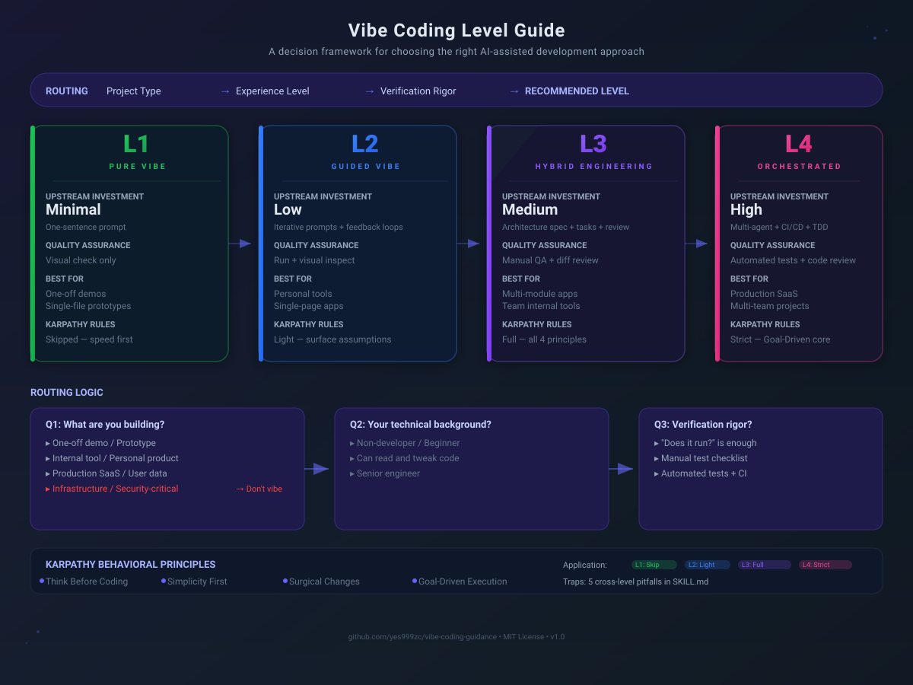

<p align="center">
  
</p>

<p align="center">
  <a href="https://github.com/yes999zc/vibe-coding-guidance/blob/main/LICENSE">
    
  </a>
  <a href="https://github.com/yes999zc/vibe-coding-guidance">
    
  </a>
  <a href="https://github.com/yes999zc/vibe-coding-guidance/blob/main/SKILL.md">
    
  </a>
  <a href="#">
    
  </a>
</p>

<h3 align="center">
  Find your Vibe Coding level — from pure vibes to production-grade orchestration
</h3>

<br/>

---

## Overview

**Vibe Coding** is a term coined by [Andrej Karpathy](https://x.com/karpathy/status/1886192184808149383) in February 2025:

> *"There's a new kind of coding I call 'vibe coding', where you fully give in to the vibes, embrace exponentials, and forget that the code even exists."*

But his [MenuGen experience](https://karpathy.bearblog.dev/vibe-coding-menugen/) revealed a hard truth: **not every project should be pure-vibed**. The line between "fun Saturday hack" and "production nightmare" is sharp — and this guide helps you navigate it.

This framework classifies vibe coding into **4 maturity levels (L1–L4)** based on project type, technical background, and verification rigor. It also integrates **Karpathy's 4 behavioral principles** to avoid common AI coding pitfalls.

---

## The 4 Levels

| Level | Name | Upfront Investment | QA Method | Best For |
|:------|:-----|:------------------|:----------|:---------|
| **L1** | Pure Vibe | Minimal — one-sentence prompt | Visual check | One-off demos, prototypes |
| **L2** | Guided Vibe | Low — iterative prompts | Run + inspect | Personal tools, SPAs |
| **L3** | Hybrid Engineering | Medium — architecture spec + review | Manual QA + diff review | Multi-module apps, team tools |
| **L4** | Orchestrated | High — multi-agent + CI/CD + TDD | Automated tests + code review | Production SaaS, multi-team |

### Routing Logic

The level is determined by answering 3 questions:

```
Q1: What are you building?
    ├── One-off demo / Prototype → continue to Q2
    ├── Internal tool / Personal product → L2-L3 (depends on Q2)
    ├── Production SaaS / User data → L3-L4
    └── Infrastructure / Security-critical → Don't vibe code this
                            │
Q2: Your technical background?
    ├── Non-developer / Beginner → L1-L2 (warn about deployment pitfalls)
    ├── Can read and tweak code → L2-L3
    └── Senior engineer → L3-L4 (you can steer)
                            │
Q3: Verification rigor?
    ├── "Does it run?" is enough → L1-L2
    ├── Manual test checklist → L2-L3
    └── Automated tests + CI → L3-L4
```

---

## Karpathy's 4 Behavioral Principles

Each level applies these principles differently:

| Principle | L1 | L2 | L3 | L4 |
|:----------|:---|:---|:---|:---|
| **Think Before Coding** — Surface assumptions, don't hide confusion | Skip | Light | Full | Strict |
| **Simplicity First** — Minimum code, no speculative abstractions | Light | Mild | Full | Strict |
| **Surgical Changes** — Touch only what you must | N/A | Mild | Full | Strict |
| **Goal-Driven Execution** — Define success criteria, loop until verified | "It works" | Step-by-step | Test-driven | CI-verified |

Read the full guide: [`SKILL.md`](./SKILL.md) (Chinese, for Hermes AI agent) | [`SKILL_EN.md`](./SKILL_EN.md) (English)

---

## Cross-Level Pitfalls (from Karpathy's MenuGen)

These apply regardless of your level:

- **🔀 Scope creep** — AI "improves" adjacent code. Always review the diff.
- **🤫 Silent confusion** — AI fakes knowing deprecated APIs. Verify critical paths.
- **🏗️ Over-engineering** — Factory pattern for a one-liner. Call it out immediately.
- **⏩ Skipping verification** — AI moves on without waiting for results. Make it validate first.
- **🔐 Security holes** — Hardcoded keys, logging passwords, email-based user matching. Human-review security logic.

---

## Usage

### As a Hermes AI Skill (recommended)

The skill is designed to be loaded by AI agents. When loaded, the agent asks you 3 questions and routes you to the right level:

```bash
skill_view(name='vibe-coding-guidance')
```

### As a standalone document

Read [`SKILL.md`](./SKILL.md) (Chinese) or [`SKILL_EN.md`](./SKILL_EN.md) (English) and determine your level manually.

### Integrating into your project

Copy the Karpathy guidelines into your `CLAUDE.md` or Cursor rules:

```bash
curl -o CLAUDE.md https://raw.githubusercontent.com/yes999zc/vibe-coding-guidance/main/CLAUDE.md
```

---

## Related Resources

- [Karpathy's original tweet (Feb 2025)](https://x.com/karpathy/status/1886192184808149383) — The term that started it all
- [Karpathy's MenuGen post (Apr 2025)](https://karpathy.bearblog.dev/vibe-coding-menugen/) — the full vibe coding experience report
- [Karpathy-Inspired Claude Code Guidelines](https://github.com/forrestchang/andrej-karpathy-skills) — The 4 behavioral principles as a CLAUDE.md
- [awesome-vibe-coding](https://github.com/bluegalaxy111/awesome-vibe-coding) — Curated list of vibe coding tools and resources

---

## Contributing

PRs welcome! If you have ideas for improving the level definitions, adding new dimensions, or translating to more languages, open an issue or submit a PR.

## License

MIT — feel free to use, modify, and share.
